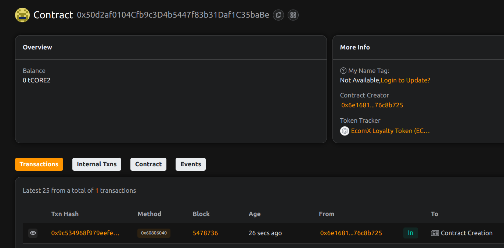

# EcomX – Token-Based E-Commerce Loyalty and Reward System

## 📄 Project Description

EcomX is a token-based loyalty program for e-commerce platforms, allowing merchants to reward customers with ERC20 tokens that can be redeemed, transferred, or burned for discounts and perks. The aim is to create a more transparent, standardized, and interoperable loyalty economy on the blockchain.

## 🎯 Project Vision

To replace outdated loyalty point systems with a standardized, on-chain, and interoperable token economy that benefits both merchants and customers.

## ✨ Key Features (Implemented)

* **🏪 Merchant-controlled Customer Rewards:** Authorized merchants can mint new ECMX tokens to reward customers for purchases or engagements. This includes a **batch reward capability** for efficient distribution to multiple customers.

* **🎁 ERC20-based Loyalty Tokens (ECMX):** A custom ERC20 token serves as the core loyalty currency, providing fungibility and transferability.

* **🔥 Token Burn Functionality for Redemptions:** Customers can burn their ECMX tokens, signifying redemption for discounts, perks, or other benefits.

* **📊 Real-time Token Balances and Ownership:** All token balances and ownership are transparently managed on-chain.

* **🔐 Role-Based Access Control:** Utilizes OpenZeppelin's AccessControl to define and manage roles (`DEFAULT_ADMIN_ROLE`, `MERCHANT_ROLE`) for secure operations.

* **🛑 Emergency Pause/Unpause Functionality:** The contract includes a `Pausable` mechanism, allowing the `DEFAULT_ADMIN_ROLE` to temporarily halt and resume core token operations (rewarding and redeeming) in emergencies or for maintenance.

* **🐛 Enhanced Error Handling:** Custom Solidity errors are implemented for clearer, more gas-efficient, and user-friendly feedback on common issues (e.g., invalid addresses, zero amounts, insufficient balance, role management errors, array mismatches).

## 🚀 Current Progress & Development Status

We have made significant progress in developing the core infrastructure for EcomX:

* **Smart Contract Development:** The `EcomXToken.sol` smart contract has been fully developed, implementing the ERC20 token standard, token burning capabilities, robust role-based access control, **emergency pause/unpause functionality**, **batch reward capabilities**, and **enhanced error handling with custom Solidity errors**.

* **Smart Contract Deployment:** The `EcomXToken.sol` contract has been successfully compiled and deployed to the `BTCS Testnet v2` blockchain.

* **Frontend Web Application:** A functional React-based Web3 frontend has been built. This application connects to MetaMask, displays user token balances, allows authorized merchants to reward customers (both individually and in batches), enables customers to redeem their tokens by burning them, and provides real-time feedback.

## 🔮 Future Scope

* **NFT-based Reward Coupons and Achievements:** Explore integrating ERC721 NFTs for unique, non-fungible rewards or achievement badges.

* **Cross-Store Reward Ecosystem with Aggregated Balances:** Design a system for interoperability across multiple e-commerce platforms, allowing customers to use their ECMX tokens seamlessly across different merchants.

* **Loyalty Token Staking with Bonus Incentives:** Implement staking mechanisms where customers can lock their ECMX tokens to earn additional rewards or special perks.

* **Layer-2 Integration for Scalability:** Investigate deploying on Layer-2 solutions to improve transaction speed and reduce gas costs for high-volume operations.

* **Advanced Redemption Logic:** Develop more sophisticated on-chain redemption rules, potentially tying token burning to specific discount tiers or product categories via smart contract logic.

## 📜 Deployment Details

The `EcomXToken.sol` smart contract is deployed on the **BTCS Testnet v2**.

* **Contract Address:** `0x50d2af0104Cf9b9C3d4B5447f83b31Daf1C35baBe`
* 

* **Network (BTCS Testnet v2) Configuration for MetaMask:**

    * **Chain ID:** `0x171` (369 in decimal)

    * **Network Name:** `BTCS Testnet`

    * **RPC URL:** `https://rpc.test2.btcs.network`

    * **Currency Symbol:** `tCORE2`

    * **Block Explorer URL:** `https://scan.test2.btcs.network`

* **Contract ABI:** The Application Binary Interface for `EcomXToken.sol` (necessary for frontend interaction) can be found in your Hardhat project's `artifacts/contracts/EcomXToken.sol/EcomXToken.json` file or exported from Remix IDE.

## 💻 Getting Started with the Frontend Application

To interact with the deployed EcomX Loyalty System, you can set up and run the provided React frontend:

1.  **Prerequisites:**

    * Node.js (LTS version recommended)

    * npm or Yarn

    * MetaMask browser extension (configured for BTCS Testnet v2)

2.  **Clone or Set Up React Project:**

    * If you have a local React project, navigate to its root. Otherwise, create a new one:

        ```bash
        npx create-react-app ecomx-frontend
        cd ecomx-frontend
        ```

3.  **Install Frontend Dependencies:**

    * Install `ethers` (for blockchain interaction):

        ```bash
        npm install ethers
        # or
        yarn add ethers
        ```

    * (Note: `react-responsive` was removed to improve compatibility in certain environments. If you want its full functionality locally, you can install `npm install react-responsive` and uncomment its import.)

4.  **Replace `src/App.js`:**

    * Copy the entire content of the `EcomX Loyalty Web3 App (React)` code block provided by the AI into your project's `src/App.js` file.

    * **Crucial:** Ensure the `ECOMX_TOKEN_ABI` constant within `src/App.js` is updated with the *actual* ABI of your deployed `EcomXToken` contract.

5.  **Configure Tailwind CSS (if not already set up):**

    * For quick local preview, add the Tailwind CSS CDN to your `public/index.html` inside the `<head>` tag:

        ```html
        <!-- public/index.html -->
        <head>
          <!-- ... existing head content ... -->
          <script src="[https://cdn.tailwindcss.com](https://cdn.tailwindcss.com)"></script>
          <link href="[https://fonts.googleapis.com/css2?family=Inter:wght@400;600;700&display=swap](https://fonts.googleapis.com/css2?family=Inter:wght@400;600;700&display=swap)" rel="stylesheet" />
        </head>
        ```

    * Also, ensure the `ethers.js` CDN is present in `public/index.html` as indicated in the React code for environments where `npm` imports are not resolved:

        ```html
        <!-- public/index.html -->
        <head>
            <!-- ... -->
            <script src="[https://cdn.ethers.io/lib/ethers-5.7.2.umd.min.js](https://cdn.ethers.io/lib/ethers-5.7.2.umd.min.js)"></script>
            <!-- ... -->
        </head>
        ```

6.  **Run the Frontend Application:**

    ```bash
    npm start
    # or
    yarn start
    ```

    Your browser should open to `http://localhost:3000` (or similar), displaying the EcomX Loyalty Program interface.

## 🤝 How to Interact

1.  **Connect Wallet:** Click the "Connect Wallet" button to link your MetaMask wallet to the application. Ensure MetaMask is connected to the BTCS Testnet v2.

2.  **Reward Customers:** If your connected wallet address holds the `MERCHANT_ROLE` on the deployed `EcomXToken` contract (granted by the `DEFAULT_ADMIN_ROLE`), a "Reward Customer" section will appear. Enter a customer's address and the desired ECMX amount, then confirm the transaction in MetaMask.
    * *(Note: The current frontend supports single rewards. For batch rewards, you would extend the UI to accept multiple addresses/amounts.)*

3.  **Redeem Tokens:** Any connected account can enter an amount to burn their ECMX tokens for redemption. Confirm the transaction in MetaMask.

4.  **View Balance:** Your current ECMX token balance will be displayed automatically after connecting your wallet and on successful transactions.
